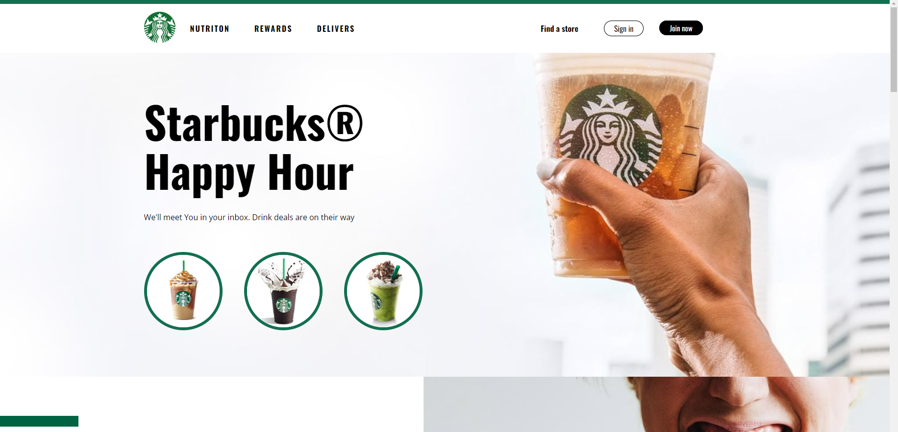

# Starbucks page 

This is a project to the [Starbucks page](https://rafaelsanm.github.io/project-starbucks-page/).  

## Table of contents

- [Overview](#overview)
  - [The challenge](#the-challenge)
  - [Screenshot](#screenshot)
- [My process](#my-process)
  - [Built with](#built-with)

## Overview

### The challenge

Users should be able to:

- See hover states for interactive elements

### Screenshots

## My process

### Built with

- Semantic HTML5 markup
- CSS custom properties
- Flexbox

### Author

Created by Rafael Santilli Machado
Credits to Nicepage.
